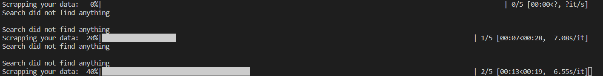

<!-- Improved compatibility of back to top link: See: https://github.com/othneildrew/Best-README-Template/pull/73 -->
<a name="readme-top"></a>
<!-- PROJECT SHIELDS -->
<!--
*** I'm using markdown "reference style" links for readability.
*** Reference links are enclosed in brackets [ ] instead of parentheses ( ).
*** See the bottom of this document for the declaration of the reference variables
*** for contributors-url, forks-url, etc. This is an optional, concise syntax you may use.
*** https://www.markdownguide.org/basic-syntax/#reference-style-links
-->
[![MIT License][license-shield]][license-url]


<!-- PROJECT LOGO -->


<!-- TABLE OF CONTENTS -->
<details>
  <summary>Table of Contents</summary>
  <ol>
    <li>
      <a href="#about-the-project">About The Project</a>
    </li>
    <li>
      <a href="#Links">Links</a>
    </li>
    <li>
      <a href="#Notes">Notes</a>
    </li>
    <li>
      <a href="#getting-started">Getting Started</a>
      <ul>
        <li><a href="#prerequisites">Prerequisites</a></li>
        <li><a href="#installation">Installation</a></li>
      </ul>
    </li>
  </ol>
</details>


<!-- ABOUT THE PROJECT -->
## About The Project

<div align="center">
    
</div>

Project have few scripts which help me in making weekly raports.

<p align="right">(<a href="#readme-top">back to top</a>)</p>


## Links

- [Scrapy in file](https://stackoverflow.com/questions/21662689/scrapy-run-spider-from-script)
- [Bash Script](https://stackoverflow.com/questions/18686824/running-scrapy-from-a-shell-script)
- [That awesome guy which show you word automation]()

## Notes

- Turning off log in Scrapy *LOG_ENABLED*
- Find the way to transform date to word document
- Did not find any info about moving excel chart to word, but it is possible to create chart with python and then move it.

<!-- GETTING STARTED -->
## Getting Started

### Prerequisites

You have to have Microsoft Office Excel and Word

### Installation

1. Install python
2. Then install dependecies using pip
   ```sh
   pip3 install -r requirements.txt
   ```

<p align="right">(<a href="#readme-top">back to top</a>)</p>


<!-- LICENSE -->
## License

Distributed under the MIT License. See `LICENSE.txt` for more information.

<p align="right">(<a href="#readme-top">back to top</a>)</p>


<!-- MARKDOWN LINKS & IMAGES -->
<!-- https://www.markdownguide.org/basic-syntax/#reference-style-links -->
[license-shield]: https://img.shields.io/github/license/othneildrew/Best-README-Template.svg?style=for-the-badge
[license-url]: https://github.com/othneildrew/Best-README-Template/blob/master/LICENSE.txt